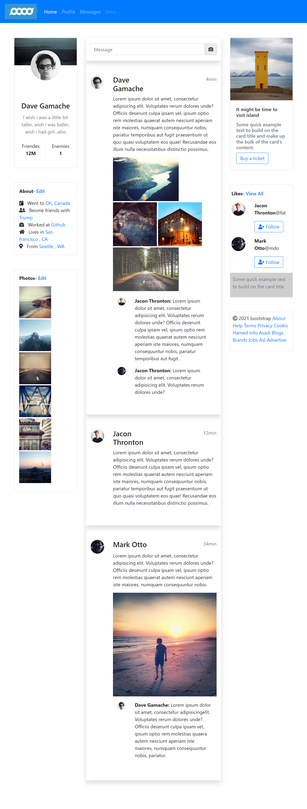

# Instance of a social media site

### The challenge
Users should be able to:
- View the optimal layout for the site depending on their device's screen size
- See images in slideshow mode
- Navigate the slider using either their mouse

### Screenshot

## Links
- Live Site URL: [Shortly URL](https://hamed3958.github.io/social-media-site/)

### Built with
- HTML5
- CSS
- [Bootstrap](https://getbootstrap.com/) - CSS framework
- [Lightbox2](https://lokeshdhakar.com/projects/lightbox2/) - a script used to overlay images on the current page
- [jQuery](https://jqueryui.com/) - a JavaScript library

## Author
- Website - [hamedasadiasl.ir](http://hamedasadiasl.ir/)
- Github - [@hamed3958](https://github.com/hamed3958)
- LinkedIn - [Hamed Asadi Asl](https://www.linkedin.com/in/hamed-asadi-asl/)